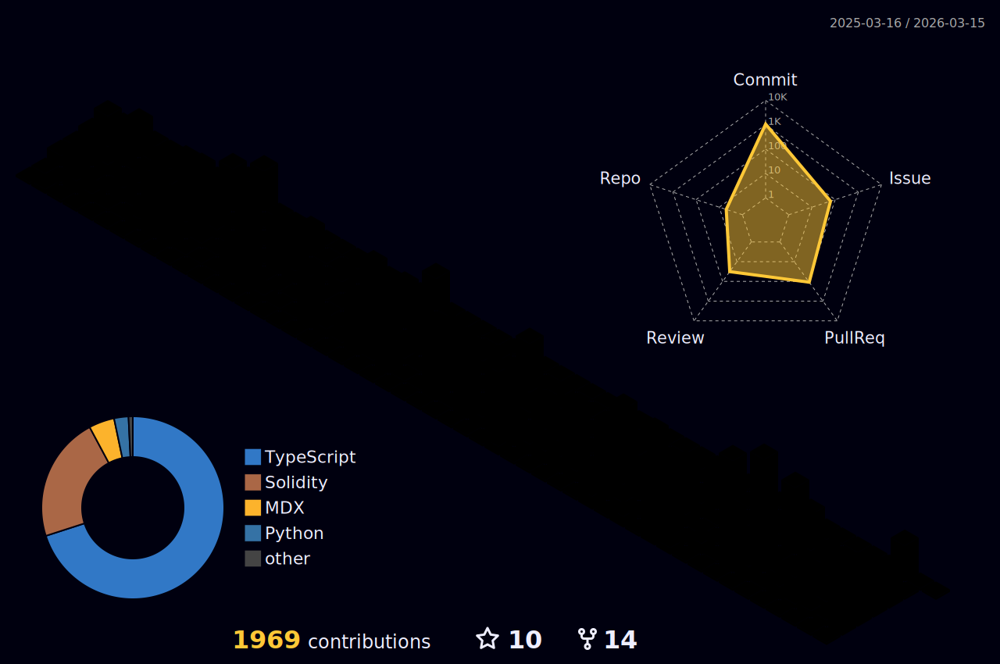

# Hi there 👋

## About Me
Shuhei Tanaka / 田中 修平 in Japanese, Based in Tokyo, Japan.
After studying economics in university and gaining experience in sales and business development, I became fascinated with blockchain technology and began my journey into engineering.

### Interests

- Mechanism design for public goods funding
- Technical approaches to solving coordination failures
- Social implementation of Web3/blockchain technology

### Personal Life
- 🎸 Playing bass
- 🏍 Motorcycle touring
- ☕️ Coffee

### Get in Touch
[X(prev Twitter)](https://x.com/shutanaka_jp)

---

